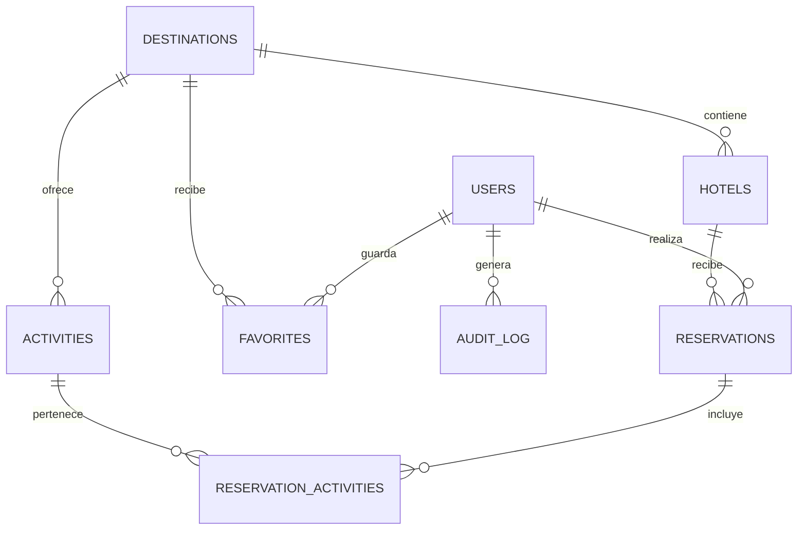

# Modelo entidad-relación

## Explicación
- Un destino puede tener muchos hoteles y actividades.
- Un usuario puede realizar varias reservaciones.
- Una reservación puede tener un hotel y varias actividades.
- La relación entre reservaciones y actividades se resuelve mediante `reservation_activities`.
- Las llaves foráneas mantienen la integridad referencial.
